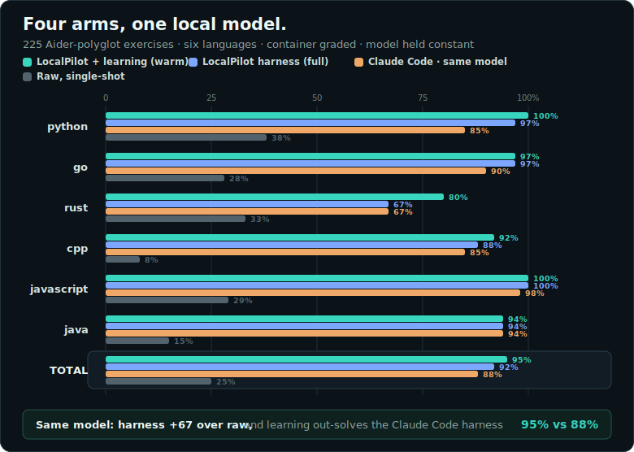

```
╔══════╗ ╔══╗		██╗      ██████╗  ██████╗ █████╗ ██╗     ██████╗ ██╗██╗      ██████╗ ████████╗
║ >_ █ ║ ║██║║		██║     ██╔═══██╗██╔════╝██╔══██╗██║     ██╔══██╗██║██║     ██╔═══██╗╚══██╔══╝
╚══╦═══╝ ║██║║		██║     ██║   ██║██║     ███████║██║     ██████╔╝██║██║     ██║   ██║   ██║
 ══╩══   ╚══╝║		██║     ██║   ██║██║     ██╔══██║██║     ██╔═══╝ ██║██║     ██║   ██║   ██║
═════════════╝		███████╗╚██████╔╝╚██████╗██║  ██║███████╗██║     ██║███████╗╚██████╔╝   ██║
					╚══════╝ ╚═════╝  ╚═════╝╚═╝  ╚═╝╚══════╝╚═╝     ╚═╝╚══════╝ ╚═════╝    ╚═╝
```

<div align="center">
  <h1>LocalPilot</h1>
  <p><strong>A local-first coding agent with a disciplined harness around any compatible model.</strong></p>
  <p>
    <a href="docs/install.md">Install</a> ·
    <a href="docs/providers.md">Providers</a> ·
    <a href="docs/configuration.md">Configuration</a> ·
    <a href="https://c0degeek-dev.github.io/LocalStack/">LocalX</a>
  </p>
  <p>
    
    
    
    
  </p>
</div>

LocalPilot gives local and hosted models the loop they need to do useful
software work: inspect files, use tools, edit safely, run checks, recover from
bad output, and keep going across sessions. The core is provider-neutral and the
risky parts stay behind explicit permission boundaries.

| At a glance | |
|---|---|
| **Use it when** | You want a coding agent you can run against your own model or provider |
| **Connects to** | OpenAI-compatible local servers and supported official provider APIs |
| **Works as** | Interactive terminal agent, one-shot command, rule-enforced harness, RPC service, ACP adapter, or MCP server (`localpilot mcp serve` — an MCP client/agent host drives and steers a session) |
| **Remembers through** | Embedded [LocalMind](https://github.com/C0deGeek-dev/LocalMind), with review before durable memory |
| **Status** | `2.3.0` stable; public CLI, config, and provider contract follow SemVer |

## Privacy by design

LocalPilot is built so the complete coding-agent loop can run on your machine,
against a model endpoint you control.

- **No usage telemetry is sent.** LocalPilot does not report your prompts, code,
  tool calls, transcripts, or usage to us.
- **Local is the default.** The default provider targets a local endpoint, and
  files, logs, transcripts, and memory remain under your control.
- **Remote providers are explicit.** If you configure a hosted provider, the
  relevant requests go to that provider—not to LocalX—and you can return to the
  local-only path at any time.
- **You control access.** Workspace boundaries, permission gates, secret
  redaction, and review-gated memory keep sensitive actions visible and
  reversible.

## Quick start

You need Rust, Git, and a C compiler. Clone with the LocalMind submodule:

```sh
git clone --recurse-submodules https://github.com/C0deGeek-dev/LocalPilot.git
cd LocalPilot
```

Install the full terminal build:

```sh
# Linux / macOS
./install/install.sh

# Windows PowerShell
./install/install.ps1
```

Check the environment:

```sh
localpilot doctor
```

Create `.localpilot.toml` and point it at a local OpenAI-compatible server:

```toml
[provider]
default = "local"

[providers.local]
kind = "openai-compatible"
base_url = "http://localhost:8080/v1"
model = "your-local-model"
```

Then start a conversation:

```sh
localpilot chat
```

Or ask one question without tools:

```sh
localpilot ask --model your-local-model "explain this repo's error handling"
```

Hosted APIs use the same configuration model; add `api_key_env` and keep the
credential in the named environment variable. The [provider guide](docs/providers.md)
covers local servers, hosted providers, context windows, authentication, and
reasoning settings.

## Why the harness matters

The model is only one part of a coding agent. In a pinned comparison across 225
Aider-polyglot exercises, the same local model solved **25%** of tasks raw and
**92%** through LocalPilot: a **67-point uplift** from tools, iteration, test
feedback, and recovery. With learning on it reached **95%** — out-solving the
Claude Code harness driving the *same* pinned local model (**88%**); a harness
comparison on one model, not a model claim.




> [!NOTE]
> Read the delta, not the absolute score. This is one model and quant; public
> benchmark data can be contamination-prone, and the 600-second timeout counts
> an exercise as unsolved.

## The core workflow

| Command | Use it for |
|---|---|
| `localpilot` / `localpilot chat` | Interactive coding sessions with tools and approvals |
| `localpilot ask` | One prompt, no tools |
| `localpilot print` | A non-interactive agent run for scripts and pipelines |
| `localpilot init` | Project-local configuration and ignore rules |
| `localpilot models` | Models reported by configured OpenAI-compatible servers |
| `localpilot session list` | Find, export, name (`session name`, or `/name` in chat), resume — by id or name — or prune durable sessions |
| `localpilot harness …` | Rule-enforced intake, planning, feature work, and resume |
| `localpilot research` | Research a topic across local sources and the web (on by default — disclosed, allowlist-gated, audited; `--no-web` skips it) with multi-round, coverage-driven retrieval, optional MCP search proposers, and depth knobs (`--rounds`, `--quick`); writes a report and review-gated memory candidates |
| `localpilot doctor` | Diagnose providers, credentials, tools, trust, and configuration |

Additional surfaces include MCP tools, `rpc`, `acp`, `mcp serve`, project
knowledge ingestion, memory search, skill inspection, handoffs, self-review,
and redacted session exports. `localpilot mcp serve` turns the session runtime
itself into an MCP server another agent host drives: `prompt` (with mid-turn
`steer`/`follow_up` dispositions), `cancel`, `status`, `transcript`, a
cursor-paged `events` feed, and `reply_permission`, with
`--continue`/`--resume` to pick an earlier session back up and
`--no-approvals` for watch-and-steer coaching (the reply tool is withheld, so
every ask denies). Corrections the driver makes become review-gated lesson
candidates. Run `localpilot --help` for the complete command tree.

### Terminal controls

- `Enter` sends; `Alt+Enter`, `Ctrl+J`, or a trailing `\` inserts a newline.
- `↑` / `↓` recalls project-scoped prompt history.
- `Ctrl-C` cancels the current turn or ingest run. At the prompt it is staged
  like a shell: with text typed (or an autocomplete overlay open), the first
  press clears the composer and dismisses the overlay; on an empty composer it
  quits.
- `/` opens slash-command completion; `@` mentions a workspace file.
- `/model` changes provider or model without losing the conversation.
- `/name` names the session so it can be resumed by name.
- `/default`, `/relaxed`, `/bypass`, and `/unrestricted` switch the permission
  profile mid-turn, taking effect from the running turn's next tool call.

The REPL uses the terminal's normal screen buffer, so native scrollback,
selection, and copy/paste continue to work.

## Learns, with your approval

The embedded LocalMind engine distills decisions, fixes, conventions, and tool
recipes from your sessions — **on by default** as of this release, and
**local-only** (it never leaves your machine). Candidates enter a review queue;
only accepted lessons become durable, machine-wide memory and return as context
in future sessions. It is review-gated and redacted, so this is disclosure, not
a data grab — opt out any time with `[learning] enabled = false` in the
project's **`.localmind.toml`** (the learning engine's config, not
`.localpilot.toml`; see [localmind-integration.md](docs/localmind-integration.md)).

```text
session ──> candidate lessons ──> your review ──> project memory ──> later sessions
```

In a controlled uplift evaluation, accepted lessons moved a deliberately
headroom-rich task set from **0% to 100%**, and the effect held on a second
model. By default (`[review] mode = "manual"`) nothing is written to durable
memory without human review; the opt-in `trusted`/`automatic` review modes
auto-promote high-confidence candidates without prompting — see
[localmind-integration.md](docs/localmind-integration.md).

## Pick the right guide

| Topic | Guide |
|---|---|
| Installation and updates | [Install](docs/install.md) |
| Providers and credentials | [Providers](docs/providers.md) |
| Full configuration schema | [Configuration](docs/configuration.md) |
| Tools and permissions | [Tool system](docs/05-tool-system.md) and [Security](docs/security.md) |
| MCP servers | [MCP](docs/mcp.md) |
| Embedding, RPC, and ACP | [Embedding](docs/embedding.md) |
| Adding providers or tools | [Extending](docs/extending.md) |
| Harness guarantees | [Harness specification](docs/06-harness-spec.md) |
| Release history | [Changelog](CHANGELOG.md) |

<details>
<summary><strong>Developing LocalPilot</strong></summary>

The local gate mirrors CI:

```sh
cargo fmt --check
cargo clippy --workspace --all-targets -- -D warnings
cargo test --workspace
cargo check --workspace
cargo build -p localpilot --features tui
cargo clippy -p localpilot --features tui --all-targets -- -D warnings
cargo machete
cargo deny check
cargo audit
```

The default binary includes LocalMind-backed learning. The `tui` feature adds
the interactive terminal, and `keychain` adds the Windows credential backend.

</details>

## Principles

LocalPilot is an original implementation, not a fork or redistribution of a
vendor CLI. It uses official APIs or local servers, keeps project state local,
and requires explicit approval for risky actions. Windows, Linux, and macOS are
first-class platforms.

Maintained by C0deGeek.dev (David and Bram).

## LocalX

LocalPilot is the agent layer in the
[LocalX toolchain](https://c0degeek-dev.github.io/LocalStack/):

| Project | Role |
|---|---|
| [LocalBox](https://github.com/C0deGeek-dev/LocalBox) | Run local models |
| [LocalBench](https://github.com/C0deGeek-dev/LocalBench) | Find fast, stable settings |
| **LocalPilot** | Code through the agent harness |
| [LocalMind](https://github.com/C0deGeek-dev/LocalMind) | Turn reviewed sessions into reusable project memory |
